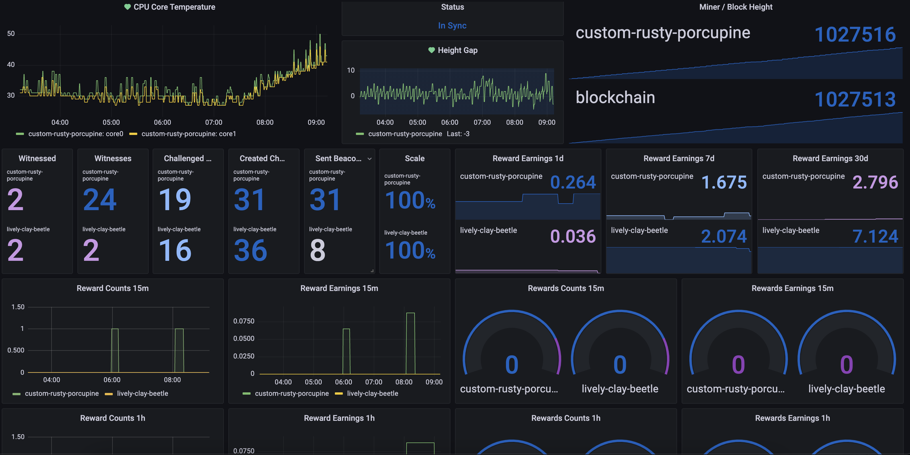

# HNT Miner Monitor




HNT: 13Vazr2mTQSbu2wBGAkqpaLvJQEdSv5aMd3qpdXFJSw2pfNpqC4

## Overview

This repo is used to produce metrics from miner api's and the Helium blockchain. We can use the metrics to diagnose, alert, and prevent poor mining performance. Currently we extract the following metrics:

**Hotspot API**

- activity metrics
- block height
- reward counts (15 minute, 1 hour, 1 day, 7 days, 30 days)
- reward scale
- witnessed
- witnesses

**Bobcat API**

- block height
- cpu temperatures
- height gap
- miner height
- sync status

**LongAP**

- block height
- height gap
- miner connected
- miner height
- online status
- sync status

**Nebra**

- block height
- bluetooth connected
- frequency
- height gap
- lora status
- miner connected
- miner height
- relayed
- sync percent
- sync status

**Sensecap API**

- antenna gain
- block height
- cpu temperature
- cpu used
- dialable
- height gap
- is healthy
- memory total
- memory used
- nat type
- miner connected
- miner height
- relayed
- sd total
- sd used
- sync status
<br />

## Prerequisite

### Linux +(MacOS): Without using docker ###

If you plan to not use docker to manage your metric collection, you will need to have your monitoring platform setup by using `prometheus`, `prometheus push gateway`, and `grafana`. The pushgateway, from prometheus, will allow us to push metrics to prometheus instead of trying to host the metrics ourselves on an http endpoint.

- **Prometheus**
  - [prometheus push gateway](https://github.com/prometheus/pushgateway)
  - [prometheus](https://prometheus.io/docs/prometheus/latest/installation)

- **Grafana**
  - [grafana](https://grafana.com/docs/grafana/latest/installation)

- **JQ**
  - [jq](https://stedolan.github.io/jq/download/)
<br />

### Linux +(MacOS) & Windows: Using docker and docker-compose ###

#### Linux +(MacOS) ####

You can install `docker` and `docker-compose` by running the `hnt_monitor.sh` script. This will install all of the dependencies necessary, walk you through a setup wizard, and deploy the service. With docker we can create the entire monitoring stack using `docker-compose`.

```bash
$> ./hnt_monitor.sh
```

If you want to only install the dependencies and not setup and deploy, you can pass in the argument `prereq` to the `hnt_monitor.sh` script.

```bash
$> ./hnt_monitor.sh prereq
```
<br />

#### Windows ####

You will need to install `docker` and `docker-compose` manually. You can do that by installing docker desktop for windows.

- [docker](https://docs.docker.com/desktop/windows/install/)
<br />

## Quick Start: Linux +(MacOS) only ##

### Linux +(MacOS): setup & installation ###

The `hnt_monitor.sh` script will install the necessary software and walk you through setting up the monitor stack. Follow the prompts, input your miners, and let the script install the platform

```bash
$> ./hnt_monitor.sh
```
<br />

## Deep Dive ##

### Linux +(MacOS): Without docker ###

Navitage to the `src/conf/` directory and add your miners hotspot address (the public address assigned to the miner on the blockchain "112nVe...") to the `address.list` file. Next, update the `hnt_monitor.conf` file with your prometheus push gateway host and port, <your_miner>_monitor=true, and supply your miners addresses. Then run the hnt monitor script manually in the `src/bin` directory. You can visit the `host:port` of the machine running prometheus pushgaeway and see the new metrics.

```bash
$> ./src/bin/hnt_monitor
```

Run in the background if you want to make it a service

```bash
$> ./src/bin/hnt_monitor &
```

---
**NOTE**

- `*_addresses=`&nbsp;&nbsp;&nbsp;&nbsp;&nbsp;&nbsp;&nbsp;&nbsp;&nbsp;&nbsp;is always referring to the hotspot public address found on the blockchain and explorer. This is the long character string like `112vGthen34DVHjnj...`

- `*_ips=`&nbsp;&nbsp;&nbsp;&nbsp;&nbsp;&nbsp;&nbsp;&nbsp;&nbsp;&nbsp;&nbsp;&nbsp;&nbsp;&nbsp;&nbsp;&nbsp;&nbsp;&nbsp;&nbsp;&nbsp;&nbsp;&nbsp;is always referring to the hotspot private ip addresses that is assigned by your internal router. `192.168.2.1`

- `*_serial_numbers`&nbsp;&nbsp;is always referring to the hotspot unique id identifier that your vendor has supplied

You can add multiple miners by quoting and separating with a space. `"address1 address2 address3"` 

---
<br />

### Linux +(MacOS) & Windows: docker without docker-compose ###

Run the hnt monitor script standalone

```bash
$> docker build -t hnt_monitor -f build/docker/Dockerfile .
$> docker run --rm -it hnt_monitor help     # help menu
$> docker run -d -e HNT_HOTSPOT_MONITOR=true -e HNT_HOTSPOT_ADDRESSES="12345..." -e HNT_PROMETHEUS_PG_HOST=http://my.prometheus-pushgateway.host:9091 hnt_monitor  # Enable hotspot monitoring from helium api
```
<br />

### Linux +(MacOS) & Windows: docker with docker-compose ###

#### Linux +(MacOS): Automated Setup & Deploy ####

Run the `hnt_monitor.sh` script to configure the docker-compose settings and launch the stack.

```bash
$> ./hnt_monitor.sh
```
<br />

#### Linux +(MacOS) & Windows: Manual Setup & Deploy ####

Edit the `hnt_monitor.yml` file and add your miner information to the `hnt_monitor` service environment variables.

```bash
  hnt_monitor:
    container_name: hnt_monitor
    image: hnt_monitor:latest
    build:
      dockerfile: ./build/docker/Dockerfile
      context: .
    environment:
      DO_NOT_REMOVE: "setup"
      HNT_HOTSPOT_MONITOR: "true"
      HNT_HOTSPOT_ADDRESSES: "<myminersaddress> "   # Update your miner address on this line before launching the stack
      HNT_PROMETHEUS_PG_HOST: "http://prometheus_pushgateway:9091"
      HNT_DEBUG: "true"
    networks:
      hnt_monitor:
        ipv4_address: 10.30.0.05
    depends_on:
      - prometheus_pushgateway
```

Check the variables table below for more options that the `hnt_monitor` supports. Once you're satisfied, you can run the `docker-compose`, `up` command, below to launch the stack.

```
$> docker-compose -f hnt_monitor.yml up -d --build
```

Once `docker-compose` completes, you can verify the endpoints in your browser. Open your favorite web browser and check the following endpoints

| Application | Endpoint |
|:-----------:|----------|
| grafana | http://localhost:3000 |
| prometheus | http://localhost:9090 |
| prometheus pushgateway | http://localhost:9091 |
<br />

## Upgrading

### Linux +(MacOS): Automated Upgrade ###

Using the `hnt_monitor.sh` you can provide the `update` command to pull down the latest release and deploy. This will automatically reset any local changes you have made so be sure to copy your work to another directory if you have done your own development. You **do not** need to worry about the `hnt_monitor.yml` changess that exist. The `hnt_monitor.sh` script will use its own .yml file

```bash
$> ./hnt_monitor.sh update
```
<br />

### Linux +(MacOS) & Windows: Manual updates ###

If you have to update manually there are a couple of things you need to do so you dont lose your settings. Make sure to do the following to update your version safely.

- Copy the existing `hnt_monitor.yml` to another directory
- Git pull the repo down and checkout the release version or download and unzip the release
- Copy your `hnt_monitor.yml` to the new release
- Then run `docker-compose -f hnt_monitor.yml up -d --build`

<br />

## Verify Installtation

Check the prometheus push gateway to see metrics have been pushed from the `hnt_monitor`. This service is listening 9091, navigate to `http://localhost:9091` in your browser. You should see a screen like below, with all of the available metrics from the miner collector.

---
**NOTE**

Initial etl processing takes up to 2 minutes to push data. Please allow time for the metrics to be pushed before verification. 

---


### Docker Logs ###

```bash
$> docker logs -f hnt_monitor
```
<br />

## Help

```bash
$> docker run -it --rm hnt_monitor help
```
<br />

## Variables

| Name | Default | Description | Required |
|:----:|---------|-------------|----------|
| `HNT_BLOCKS_URL` | `api.helium.io/v1/blocks` | The helium blocks api url. | `no` |
| `HNT_BOBCAT_IPS` | | If bobcat monitoring enabled, list of ips. Ex: '192.x.x.2 192.x.x.3 192.x.x.etc' | `no` |
| `HNT_BOBCAT_MONITOR` | `false` | Enable or disable bobcat monitoring. Boolean: `(true or false)` | `no` |
| `HNT_DEBUG` | `false` | Turn on debug logging. Boolean: `(true or false)` | `no` |
| `HNT_HELIUM_MONITOR` | `true` | Enable or disable helium monitoring. Boolean: `(true or false)` | `no` |
| `HNT_HOTSPOT_ADDRESSES` | | Hotspot miner addresses to get metrics from. Ex: 'address1 address2 address3 etc' | `no` |
| `HNT_HOTSPOT_MONITOR` | `false` | Enable hotspot monitoring from helium api. Boolean: `(true or false)` | `no` |
| `HNT_HOTSPOT_URL` | `api.helium.io/v1/hotspots` | The helium hotspot api url. | `no` |
| `HNT_LOGFILE` | `stdout` | Send logs to this file | `no` |
| `HNT_LOGPATH` | `/dev/` | Send logs to this path | `no` |
| `HNT_LONGAP_ADDRESSES` | | If longap monitoring enabled, list of ips. Ex: 'address1 address2 address3' | `no` |
| `HNT_LONGAP_MONITOR` | `false` | Enable or disable bobcat monitoring. Boolean: `(true or false)` | `no` |
| `HNT_NEBRA_IPS` | | If nebra monitoring enabled, list of ips. Ex: '192.x.x.2 192.x.x.3 192.x.x.etc' | `no` |
| `HNT_NEBRA_MONITOR` | `false` | Enable or disable nebra monitoring. Boolean: `(true or false)` | `no` |
| `HNT_PROJECT` | `hnt_monitor` | The name of the metric prefix when sending to prometheus. | `no` |
| `HNT_PROMETHEUS_PG_HOST` | `http://localhost:9091` | The prometheus push gateway hostname. | `yes` |
| `HNT_SENSECAP_API_KEY` | | Api key for sensecap | `no` |
| `HNT_SENSECAP_MONITOR` | `false` | Enable or disable sensecap monitoring. Boolean: `(true or false)` | `no` |
| `HNT_SENSECAP_SERIAL_NUMBERS` | | If sensecap monitoring enabled, list of Serial numbers of the sensecap miners | `no` |
| `HNT_TRACE` | `false` | Turn on trace logging. Produces more logs than debug. Boolean: `(true or false)` | `no` |
<br />

## What's next

- [Scheduling](docs/scheduling.md)
- [Setup Grafana](docs/setup.md)
- [Create Dashboards](docs/dashboards.md)
- [Create Alerts](docs/alerts.md)
- [Advanced Settings](docs/advanced.md)
<br />

## Tips & Donations

Always welcomed, never required =)


HNT: 13Vazr2mTQSbu2wBGAkqpaLvJQEdSv5aMd3qpdXFJSw2pfNpqC4

