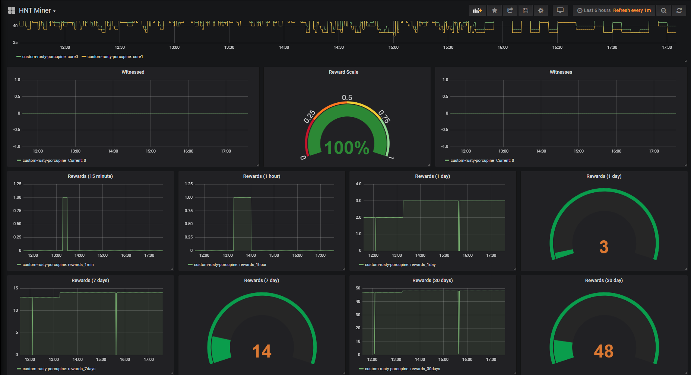

# HNT Miner Monitor

This repo is used to produce metrics from the various api endpoints on the hnt blockchain and push them to prometheus push gateway service. Currently we extract the following metrics:

**Hotspot API**

- rewards (15 minute, 1 hour, 1 day, 7 days, 30 days)
- witnessed
- witnesses
- reward scale

**Bobcat API**

- temperature

## Prerequisite

**Required**

- [prometheus push gateway](https://github.com/prometheus/pushgateway)
- [prometheus](https://prometheus.io/docs/prometheus/latest/installation)
- [grafana](https://grafana.com/docs/grafana/latest/installation/docker)

**Nice to have**

- [docker](https://docker.io)

You should have your monitoring platform setup by using prometheus and grafana. The pushgateway, from prometheus, will allow us to push metrics to prometheus instead of trying to host the metrics ourselves on an http endpoint.

## Quick Start

**Local *nix**

Navitage to the `conf/` directory and add your miner address to the `address.list` file. Then update the `hnt_monitor.conf` file with your prometheus push gateway host and port. Then run the hnt monitor script manually. You can visit the `host:port` of the machine running prometheus pushgaeway and see the new metrics

```bash
$> ./bin/hnt_monitor
```

**Docker**

```bash
$> docker run --rm -it hnt_monitor help     # help menu
$> docker run -d -e HOTSPOT_MONITOR=true -e MINER_ADDRESSES="12345..." -e PROMETHEUS_PG_HOST=my.prometheus-pushgateway.host hnt_monitor  # Enable hotspot monitoring from helium api
```

## Docker

**Build**

The HNT Monitor is supported on docker. Pull down the repo, and run the following command:

```bash
$> docker build -t hnt_monitor -f build/docker/Dockerfile .
```

**Run**

Run it

```
$> docker run -d -e BOBCAT_MONITOR=true -e BOBCAT_IPS="192.168.1.2 54.35.54.35" -e PROMETHEUS_PG_HOST="my.prometheus-pushgateway.host -e PROMETHUS_PG_PORT=9091 hnt_monitor
```

**Help Menu**

```bash
$> docker -it --rm hnt_monitor help
```

## Scheduling 

Since this is a bash script you can schedule the scripts to run at any preferred interval. Generally no more than once a minute so you are not hitting the HNT API too often with queries. I recommend running on a 5 minute interval.

```bash
$> crontab -e

*/5**** /opt/hnt_monitor/bin/hnt_monitor
```

## Monitoring

Use grafana to monitor prometheus metrics and start adding your own widgets to view the data as you like



## Tips & Donations

Always welcomed, never required =) 

HNT: 13Vazr2mTQSbu2wBGAkqpaLvJQEdSv5aMd3qpdXFJSw2pfNpqC4
