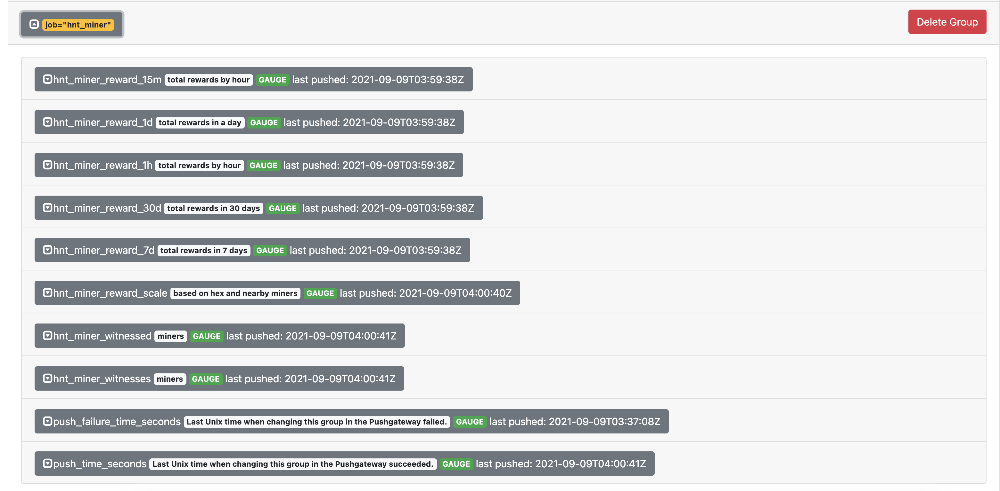

# HNT Miner Monitor

## Overview

This repo is used to produce metrics from the various api endpoints on the hnt blockchain and push them to prometheus push gateway service. Currently we extract the following metrics:

**Hotspot API**

- rewards (15 minute, 1 hour, 1 day, 7 days, 30 days)
- witnessed
- witnesses
- reward scale

**Bobcat API**

- temperature

## Prerequisite

**Required**

- [prometheus push gateway](https://github.com/prometheus/pushgateway)
- [prometheus](https://prometheus.io/docs/prometheus/latest/installation)
- [grafana](https://grafana.com/docs/grafana/latest/installation/docker)

**Nice to have**

- [docker](https://docker.io)

You should have your monitoring platform setup by using prometheus and grafana. The pushgateway, from prometheus, will allow us to push metrics to prometheus instead of trying to host the metrics ourselves on an http endpoint.

## Quick Start

**Local \*nix**

Navitage to the `conf/` directory and add your miner address to the `address.list` file. Then update the `hnt_monitor.conf` file with your prometheus push gateway host and port. Then run the hnt monitor script manually. You can visit the `host:port` of the machine running prometheus pushgaeway and see the new metrics

```bash
$> ./bin/hnt_monitor
```

**Docker**

```bash
$> docker run --rm -it hnt_monitor help     # help menu
$> docker run -d -e HOTSPOT_MONITOR=true -e MINER_ADDRESSES="12345..." -e PROMETHEUS_PG_HOST=my.prometheus-pushgateway.host hnt_monitor  # Enable hotspot monitoring from helium api
```

## Docker

The HNT Monitor is supported on docker. Pull down the repo, and run the following command:

**Build**

```bash
$> docker build -t hnt_monitor -f build/docker/Dockerfile .
```

**Run**

```
$> docker run -d --name hnt_monitor -e BOBCAT_MONITOR=true -e BOBCAT_IPS="192.168.1.2 54.35.54.35" -e PROMETHEUS_PG_HOST="my.prometheus-pushgateway.host -e PROMETHUS_PG_PORT=9091 hnt_monitor
```

**Help Menu**

```bash
$> docker run -it --rm hnt_monitor help
```

**Logs**

```bash
$> docker logs -f hnt_monitor
```

**Variables**

| Name | Default | Description | Required |
|:----:|---------|-------------|----------|
| INTERVAL | `60` | Run the monitor collection once every 'n' seconds. | `no` |
| MINER_ADDRESES | | Hotspot miner addresses to get metrics from. Ex: 'address1 address2 address3 etc' | `yes` |
| PROJECT | `hnt_monitor` | The name of the metric prefix when sending to prometheus. | `no` |
| HOTSPOT_URL | `api.helium.io/v1/hotspots` | The helium hotspot api url. | `no` |
| PROMETHEUS_PG_HOST | `localhost` | The prometheus push gateway hostname. | `yes` |
| PROMETHEUS_PG_PORT | `9091` | The prometheus push gateway port. | `no` |
| BOBCAT_MONITOR | `false` | Enable or disable bobcat monitoring. Boolean: `(true or false)` | `no` |
| HOTSPOT_MONITOR | `false` | Enable hotspot monitoring from helium api. Boolean: `(true or false)` | `yes` |
| BOBCAT_IPS | | If bobcat monitoring enabled, list of ips. Ex: '192.x.x.2 192.x.x.3 192.x.x.etc' | `no` |
| DEBUG | `false` | Turn on debug logging. Boolean: `(true or false)` | `no` |
| TRACE | `false` | Turn on trace logging. Produces more logs than debug. Boolean: `(true or false)` | `no` |
| LOGPATH | `/dev/` | Send logs to this path | `no` |
| LOGFILE | `stdout` | Send logs to this file | `no` |

## Scheduling 

**Local \*nix**

Since this is a bash script you can schedule the scripts to run at any preferred interval. Generally no more than once a minute so you are not hitting the HNT API too often with queries. I recommend running on a 5 minute interval.

```bash
$> crontab -e

*/5**** /opt/hnt_monitor/bin/hnt_monitor
```

**Docker**

If you're using docker to manage the collections, you can change the collection interval by supplying the `INTERVAL` variable during startup. By default this is set to 60 seconds (1 minute)

## Monitoring

**Prometheus Push Gateway**

You can verify your metrics have been pushed by viewing them in the prometheus push gateway UI



**Grafana**

Use grafana to monitor prometheus metrics and start adding your own widgets to view the data as you like


## Tips & Donations

Always welcomed, never required =) 

HNT: 13Vazr2mTQSbu2wBGAkqpaLvJQEdSv5aMd3qpdXFJSw2pfNpqC4
