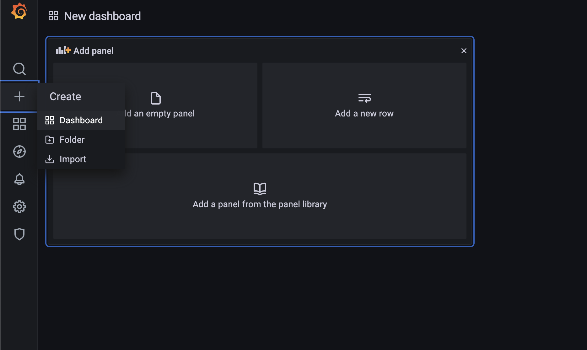
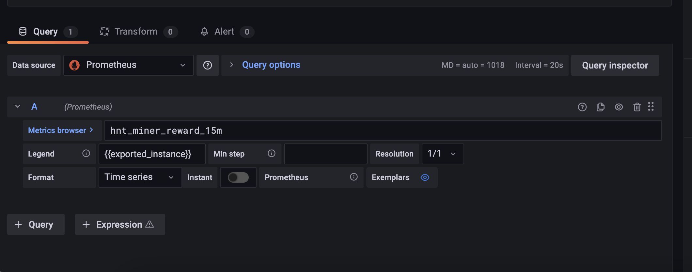
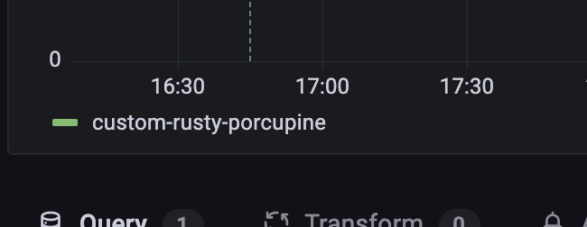
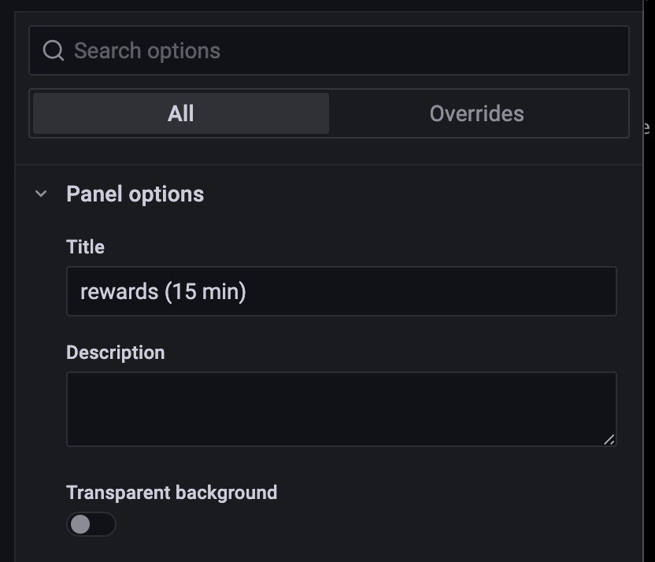
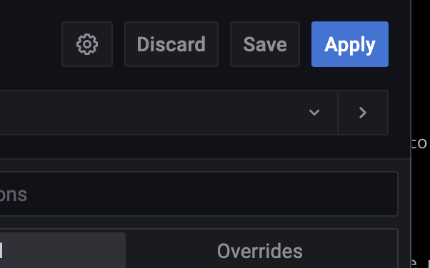
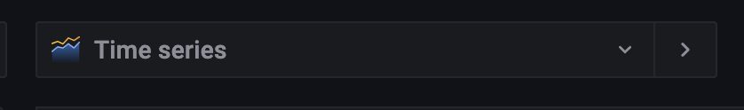
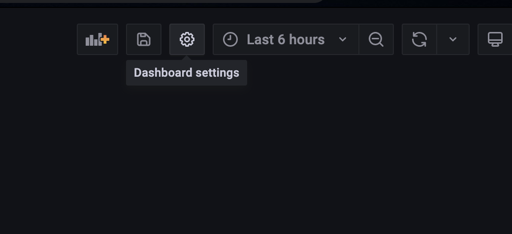
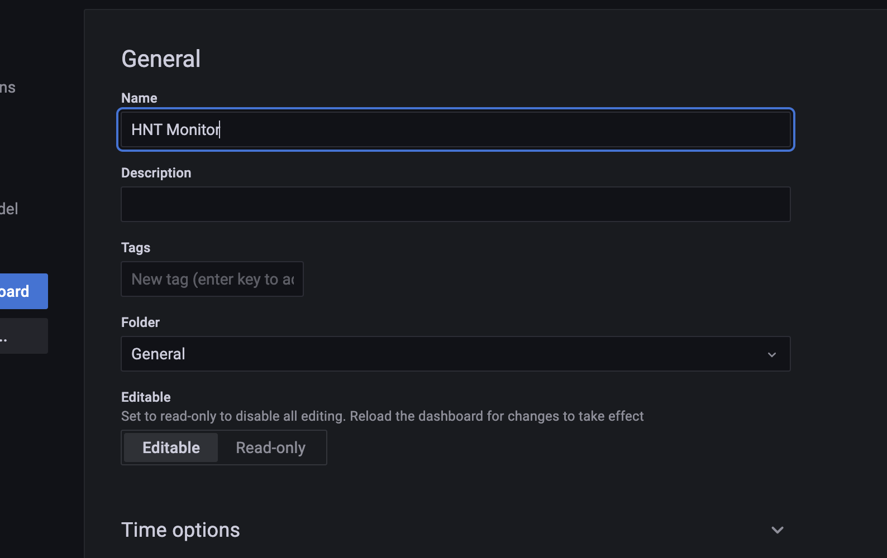
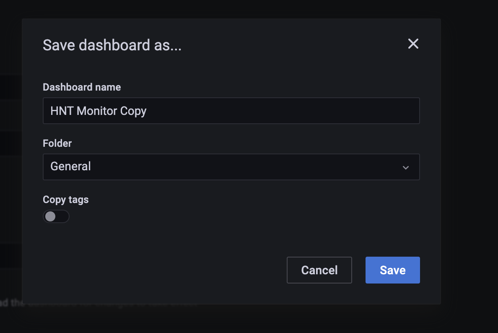

# Grafana Dashboards

Now that we can query metric data it's time to create our first dashboard. Near the top of the left nav window, you can click on the `+` to create a new dashboard.

Choose the `Add an empty panel` option and start setting up your first widget. Make sure the Data source box has `Prometheus` selected then add the query you want to start with in the `Metrics browser` section.

Notice the `Legend` I have entered `{{exported_instance}}` this is the tag that is sent in with the metric payload. I am using this to make the widget only show the name of the instance on the graph. This is the same as the actual miner name.

Lets give our new widget a title and apply it, to continue customizing our new dashboard.

Rinse and repeat this process to add more widgets to monitor. 

You can change the type of widget that is displayed by changing the default `Time series` in the top right above the panel title, to get the desired monitoring affect.

![list](images/grafana-widgetlist.png

Once you have your dashboard complete or you're just ready to save your progress, we can give the dashboard a name and save it for later viewing. Click the `dashboard settings` cog wheel in the top right and update the dashboard name.

That's it! Enjoy your new dashboard. Feel free to add and customize widgets as you see fit.

