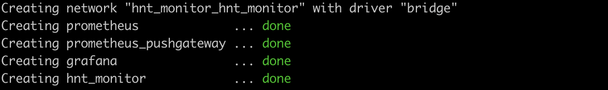

# Scheduling

**Without Docker**

You can update the frequency of the data collection in the conf file `hnt_monitor.conf`. The intervals are in (seconds).

```
# info_interval: How many seconds to wait before running the info collector
info_interval=86400

# reward_interval: How many seconds to wait before running the reward collector
rewards_interval=300

# witness_interval: How many seconds to wait before running the witness collectors
witness_interval=86400
```

The default settings on collections are good in most cases. IF you find thqt you need to change them intervals, you have the option to do so.

**Docker**

If you're using docker to manage the collections, you can change the collection intervals by supplying the correct variable during startup. 


```bash
$> docker run -d -e REWARDS_INTERVAL=300 hnt_monitor
```

Full stack run every 5 minutes. Update the `hnt_monitor.yml` at the `hnt_monitor` service section

```bash
  hnt_monitor:
    container_name: hnt_monitor
    image: hnt_monitor:latest
    build:
      dockerfile: ./build/docker/Dockerfile
      context: .
    environment:
      HNT_REWARDS_INTERVAL: "300"
      HNT_HOTSPOT_MONITOR: "true"
      HNT_HOTSPOT_ADDRESSES: "<myminersaddress> "
      HNT_PROMETHEUS_PG_HOST: "prometheus_pushgateway"
      HNT_DEBUG: "true"
    networks:
      hnt_monitor:
        ipv4_address: 10.30.0.05
    depends_on:
      - prometheus_pushgateway
```

Then stand up the stack

```bash
$> docker-compose -f hnt_monitor.yml up -d
```


## Collector Intervals

Each collector has an interval to set. Go with the defaults or change to your own frequency.

| Variable | Description | Default |
|:--------:|-------------|---------|
| `HNT_INFO_INTERVAL` | Frequency in seconds to collect miner information | `86400` |
| `HNT_REWARD_INTERVAL` | Frequency in seconds to collect miner rewards | `300` |
| `HNT_WITNESS_INTERVAL` | Frequency in seconds to collect miner wintess data | `86400` |
| `DATA_CLEANUP_INTERVAL` | Frequency in seconds to cleanup miner data | `86400` |
| `BLOCKS_INTERVAL` | Frequency in seconds to collect blockchain data | `60` |
| `INFO_INTERVAL` | Frequency in seconds to collect hotspot miner data | `86400` |
| `REWARDS_INTERVAL` | Frequency in seconds to collect reward data | `300` |
| `WITNESS_INTERVAL` | Frequency in seconds to collect witness data | `3600` |
| `BOBCAT_STATUS_INTERVAL` | Frequency in seconds to collect bobcat miner status data | `300` |
| `BOBCAT_TEMPERATURE_INTERVAL` | Frequency in seconds to collect bobcat miner temperature data | `60` |
| `BOBCAT_INFO_INTERVAL` | Frequency in seconds to collect bobcat miner info data | `21600` |
| `LONGAP_DATA_INTERVAL` | Frequency in seconds to collect longap miner data | `60` |
| `NEBRA_DATA_INTERVAL` | Frequency in seconds to collect nebra miner data | `60` |
| `SENSECAP_DATA_INTERVAL` | Frequency in seconds to collect sensecap miner data | `60` |
