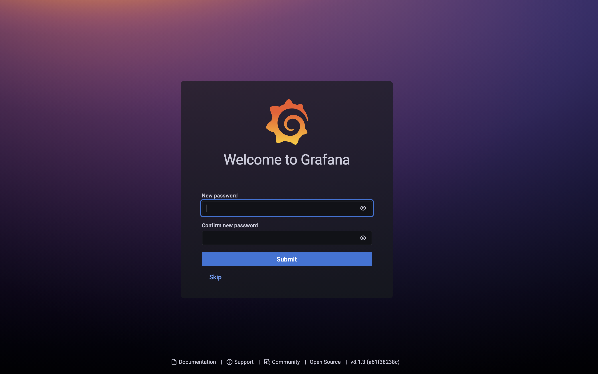
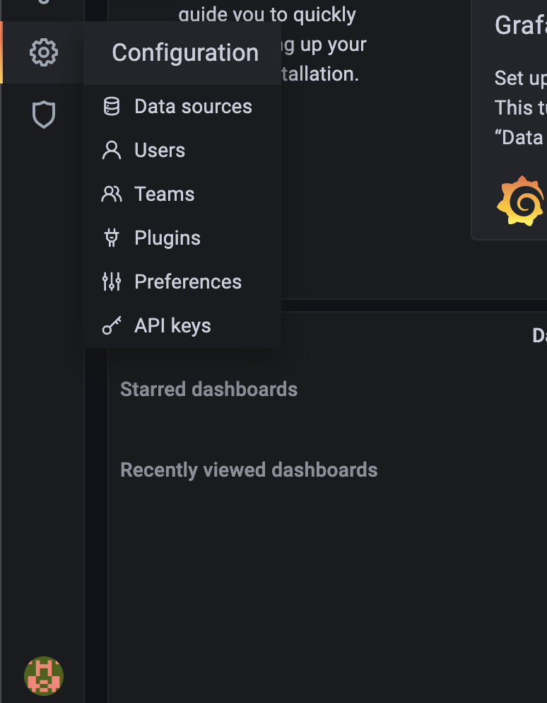
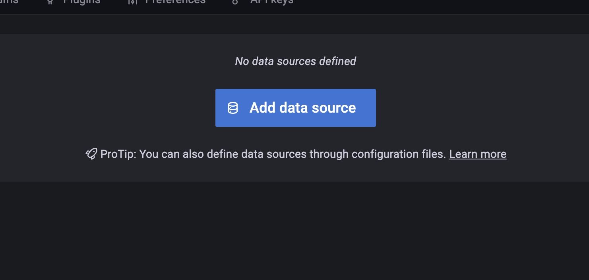
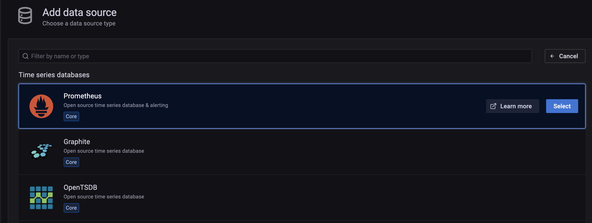
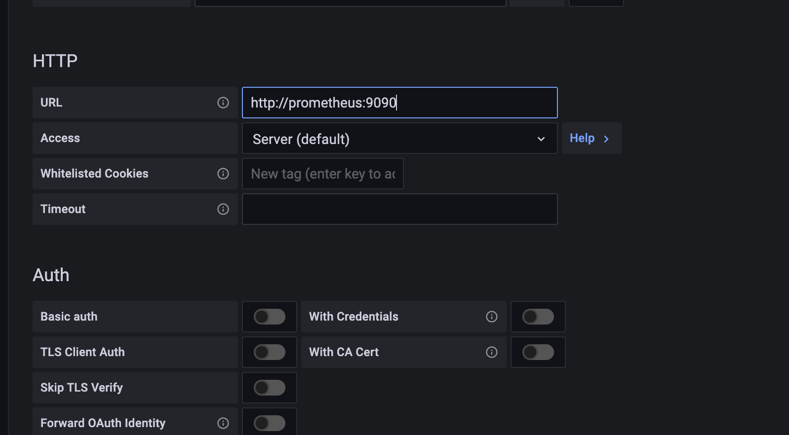
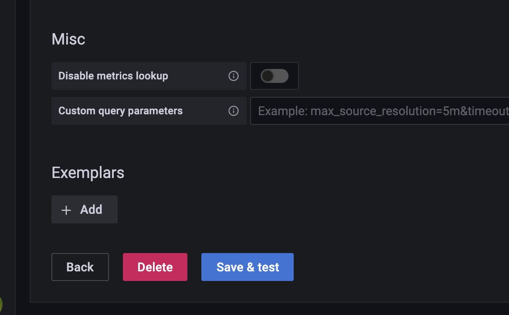

# Grafana Setup

## Login
Now that you have the full stack running, it's time to setup grafana. The first thing we need to do is login to the UI and update the default password. 

## Data Source
Next, lets add the prometheus data source to grafana for metric query. Click the configuration cog wheel in the left nav window. 

Then select `data sources` and `add data source`.

Select the `Prometheus` data source on the next page and add the URL to point to your prometheus host. 

Test and save the data source configuration and click the `back` button

Thats it, you're ready to query metrics in grafana from prometheus!
